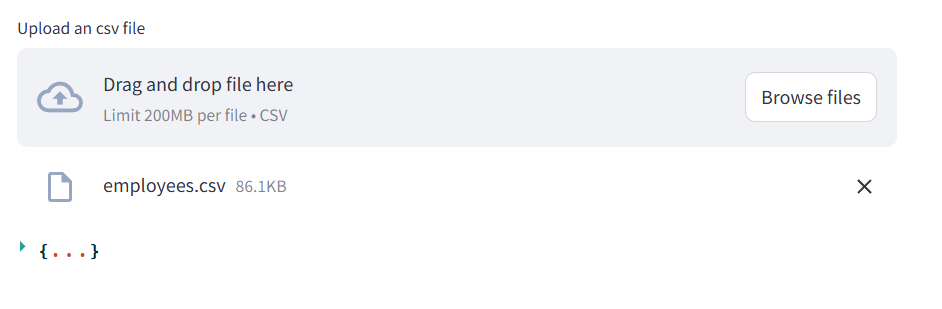

Prerequisites

* MySQL Server - Create a DB, and update its credentials in the project configuration
* Python

Installation

 > pip install -r requirements.txt

Migrations
 > python manage.py makemigrations

> python manage.py migrate
 
Tests
>python manage.py test

Starting the Application

Server:
>python manage.py runserver

Client:
>streamlit run client/streamlit_app.py

Usage

Create User:
>**API**: http://127.0.0.1:8000/api/register/
> 
> **method**: POST
> 
> **payload**: {
    "username": "admin",
    "first_name": "Admin",
    "last_name": "Super",
    "email": "admin@gmail.com",
    "mobile_number": "9874563211",
    "password": "Admin@2024"
}
> 
> 
> 
> 
**Access the client application at http://localhost:8501/ to Login and upload the file

**

Schema:

